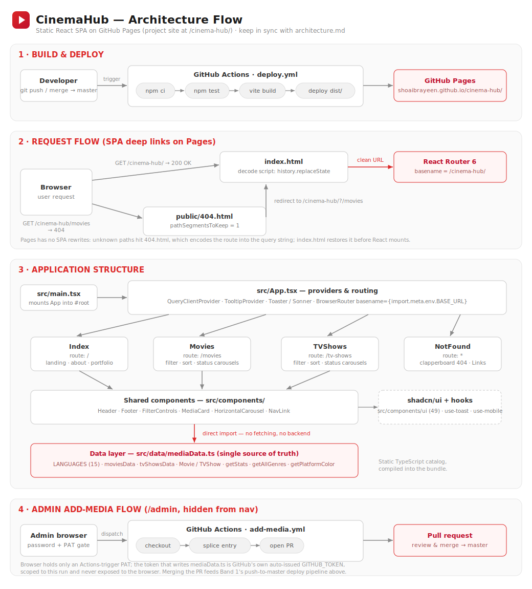

# CinemaHub — Architecture

> **Rule:** this document and [architecture.svg](architecture.svg) must be updated in the same commit as any change that affects structure, routing, data, build, or deployment. See [CLAUDE.md](CLAUDE.md).



## Overview

CinemaHub is a fully static single-page application: a personal movie/TV catalog rendered entirely client-side from data compiled into the bundle. There is no backend, no API calls, and no client-facing persistence — the whole catalog ships as TypeScript data. It deploys as a **GitHub Pages project site** served under the `/cinema-hub/` path of `https://shoaibrayeen.github.io/`.

The one exception is the hidden `/admin` page (see [Admin add-media flow](#admin-add-media-flow) below), which lets the site owner add a catalog entry through a form instead of hand-editing `mediaData.ts` — it still doesn't add a backend to the deployed app; it triggers a GitHub Actions workflow that opens a PR.

**Stack:** Vite 5 · React 18 · TypeScript · React Router 6 · Tailwind CSS + shadcn/ui (Radix) · Vitest.

## Directory layout

```
├── index.html                  # Entry: meta tags + SPA-redirect decode script
├── vite.config.ts              # base: "/cinema-hub/", @ → src alias, port 8080
├── vitest.config.ts            # jsdom environment, src/test/setup.ts, coverage thresholds (100%)
├── scripts/
│   └── add-media-entry.mjs     # CLI run by add-media.yml — splices one entry into mediaData.ts
├── .github/workflows/
│   ├── deploy.yml               # CI/CD: test → build → deploy to Pages (push to master)
│   └── add-media.yml            # workflow_dispatch: splice entry → open PR (see Admin flow below)
├── public/
│   ├── 404.html                # spa-github-pages redirect (pathSegmentsToKeep = 1)
│   ├── .nojekyll               # disable Jekyll processing on Pages
│   └── favicon.svg             # red play-button logo
└── src/
    ├── main.tsx                # mounts <App /> into #root
    ├── App.tsx                 # providers + router + route table
    ├── pages/                  # one component per route
    │   ├── Index.tsx           #   /            landing, about, portfolio link
    │   ├── Movies.tsx          #   /movies      filterable movie catalog
    │   ├── TVShows.tsx         #   /tv-shows    filterable TV catalog
    │   ├── Admin.tsx           #   /admin       hidden add-media flow (not linked from nav)
    │   └── NotFound.tsx        #   *            cinematic 404: animated clapperboard (SMIL SVG), Header + router <Link>s
    ├── components/             # shared app components
    │   ├── Header.tsx          #   sticky nav (Home / Movies / TV Shows)
    │   ├── Footer.tsx          #   copyright + portfolio link
    │   ├── FilterControls.tsx  #   language / sort / genre / status selectors
    │   ├── MediaCard.tsx       #   one catalog entry (platform badge, genres, status)
    │   ├── HorizontalCarousel.tsx  # scrollable card row
    │   ├── NavLink.tsx         #   styled router link
    │   ├── admin/              #   LoginForm.tsx, AddMediaForm.tsx (used only by Admin.tsx)
    │   └── ui/                 #   ~49 shadcn/ui primitives (generated, rarely edited)
    ├── data/
    │   └── mediaData.ts        # THE data layer — entire catalog + helpers
    ├── hooks/                  # use-mobile, use-toast
    ├── lib/
    │   ├── utils.ts            # cn() class merge helper
    │   ├── adminAuth.ts        # client-side hash-based password gate for /admin
    │   ├── githubWorkflow.ts   # triggers add-media.yml via GitHub's workflow_dispatch API
    │   ├── adminFormUtils.ts   # resolveLanguage() — "Other" language selection helper for AddMediaForm
    │   └── tvShowUtils.ts      # parseYear() — extracts a leading year from a TV show's yearRange
    └── test/                   # vitest setup + tests
```

## Data layer (`src/data/mediaData.ts`)

The single source of truth for all content. No fetching — pages import it directly.

- `LANGUAGES` (15 languages) → `Language` union type
- `Platform` — Netflix | Prime | Disney+ | HBO | Apple TV+ | Hotstar | YouTube | Theater | Other
- `WatchStatus` — Watched | Watching | Planned
- `Movie` / `TVShow` interfaces
- `moviesData: Record<string, Movie[]>` and `tvShowsData: Record<Language, TVShow[]>` — catalogs keyed by language
- Helpers: `getStats()`, `getAllGenres(type)`, `getPlatformColor(platform)`

**Data flow:** `Movies.tsx` / `TVShows.tsx` hold local UI state (`useState`: selected language, genre, status, sort) → derive the visible list with `useMemo` filters over the imported catalog → group by watch status → render `HorizontalCarousel` rows of `MediaCard`s. No global state; `QueryClientProvider` is mounted but unused (no remote data).

## Routing

`App.tsx` wires providers and the route table:

```
QueryClientProvider → TooltipProvider → Toaster/Sonner →
  BrowserRouter basename={import.meta.env.BASE_URL}
    "/"          → Index
    "/movies"    → Movies
    "/tv-shows"  → TVShows
    "/admin"     → Admin   (intentionally not linked from Header — reachable only by typing the URL)
    "*"          → NotFound
```

The `basename` comes from Vite's `base: "/cinema-hub/"`, so dev, preview, and production all serve under `/cinema-hub/`. **Internal navigation must use router `<Link>`/`useNavigate()`** — a raw `<a href="/">` escapes the base path to the user-site root.

### Deep links on GitHub Pages (spa-github-pages pattern)

GitHub Pages has no SPA rewrite support, so a hard load of `/cinema-hub/movies` would 404. Two files cooperate to recover:

1. `public/404.html` — Pages serves it for any unknown path. Its script keeps the first path segment (`pathSegmentsToKeep = 1` → `/cinema-hub`) and redirects to `/cinema-hub/?/movies`.
2. `index.html` decode script — sees the `?/` query, restores the real URL with `history.replaceState` → `/cinema-hub/movies` — before React mounts; React Router then matches the route normally.

## Build & deployment

Push/merge to `master` triggers [.github/workflows/deploy.yml](.github/workflows/deploy.yml):

```
checkout → setup-node 22 (npm cache) → npm ci → npm test → npm run build
        → configure-pages (enablement: true) → upload dist/ → deploy-pages
```

- Tests gate the deploy — a red test suite blocks publishing.
- Vite writes `dist/` with all asset URLs prefixed `/cinema-hub/`; `404.html`, `.nojekyll`, and `favicon.svg` are copied from `public/`.
- The Pages site is deployed from the workflow artifact (source: GitHub Actions), not from a branch.
- Live URL: https://shoaibrayeen.github.io/cinema-hub/

## Admin add-media flow

A hidden `/admin` page lets the site owner add a movie/TV show through a form instead of hand-editing `mediaData.ts`. The app stays fully static — no backend is added to the deployed bundle. Getting a new entry live still needs *something* with write access to the repo, so the design deliberately keeps that something out of the browser:

```
Admin browser (password gate + form)
  → workflow_dispatch (browser holds a narrow, Actions-only PAT)
    → GitHub Actions: add-media.yml (checkout → node scripts/add-media-entry.mjs → open PR)
      → owner reviews & merges the PR → push to master → deploy.yml → live
```

1. **Password gate** (`src/lib/adminAuth.ts`) — `/admin` isn't linked from `Header.tsx`. A SHA-256 hash of the credentials (computed via the browser's Web Crypto API) is compared against a hash hardcoded in source; the plaintext password is never committed. This deters casual visitors — it is not real security, since the comparison logic ships in the public JS bundle. A successful login sets a `localStorage` flag (`cinema-hub-admin-auth`).
2. **Connect GitHub** — a one-time step where the owner pastes a **fine-grained GitHub PAT scoped to Actions: Read and write only** on this repo (`src/lib/githubWorkflow.ts`, stored under `cinema-hub-github-token`). This token can only trigger the fixed `add-media.yml` workflow — it cannot write files, open PRs, or touch anything else, even if it leaked.
3. **Trigger workflow** — `AddMediaForm.tsx` collects the movie/TV show fields and calls `triggerAddMediaWorkflow()`, which POSTs to GitHub's `workflow_dispatch` REST API (`ref: "master"`) with the fields as string inputs.
4. **`.github/workflows/add-media.yml`** checks out the repo and runs `scripts/add-media-entry.mjs`, which performs a **surgical text splice** into `src/data/mediaData.ts` — it locates the target language's array (by marker/regex, not by parsing/re-serializing the whole file) and inserts one new line, so the hand-written `// --- Section --- ` organizational comments inside the Hindi movies array survive untouched. It then opens a PR via `peter-evans/create-pull-request`, using the workflow's own auto-issued `GITHUB_TOKEN` — a completely separate, more powerful credential that never leaves the GitHub-hosted runner.
5. **Review & merge** — merging the PR pushes to `master`, which triggers `deploy.yml` exactly like any other change.

**Why this design:** a simpler alternative — the browser calling GitHub's Contents API directly with a repo-write PAT — is also genuinely serverless (GitHub's REST API supports CORS), but it means a full contents-write credential sits in `localStorage`. Splitting the flow across two tokens (a narrow one in the browser, a powerful one that only exists inside the Actions runner) was chosen specifically to avoid that.

**Known trade-offs:** turnaround isn't instant (workflow queue + run time, then a manual merge — a deliberate safety net against a typo going straight to production); new entries always land at the top of their language's array rather than under a matching comment section; `workflow_dispatch`'s success response is a bare 204 with no link back to the run it started.

## Testing

Vitest + jsdom + Testing Library (`vitest.config.ts`, `src/test/setup.ts` — mocks matchMedia/ResizeObserver/scrollIntoView/scrollBy). `npm test` runs once (CI mode, with `--coverage`); `npm run test:watch` for development. **Every change must ship with tests, every source file must be covered, and coverage must stay at 100%** (lines/branches/functions/statements) — the file→suite mapping, coverage exclusion policy, and the narrow `/* v8 ignore */` exception for genuinely-unreachable defensive code live in [.claude/rules.md](.claude/rules.md). Suites:

- `src/test/mediaData.test.ts` — catalog integrity (valid languages/statuses/platforms/years, entries filed under their own language, no duplicate names within a language, no entry catalogued under more than one language) and helper contracts (`getStats`, `getAllGenres`, `getPlatformColor`)
- `src/test/app.test.tsx` — App providers + routing for `/`, `/movies`, `/tv-shows`, `/admin`, the 404 fallback, the portfolio-synced About Me card
- `src/test/pages.test.tsx` — per-page rendering: Index hero/About/hobbies, Movies/TVShows (default catalogs, genre/status filters, all three sort orders, empty-catalog language), NotFound clapperboard + escape links
- `src/test/components.test.tsx` — Header (links + active state), Footer, MediaCard (movie/TV variants), HorizontalCarousel (incl. empty state and scroll button interactions), FilterControls (conditional status selector, language/sort selection), NavLink (active class)
- `src/test/hooks.test.tsx` — useIsMobile breakpoint behavior (incl. the matchMedia change listener); useToast add/limit/dismiss/update, and the reducer's dismiss-all/remove-all paths
- `src/test/utils.test.ts` — `cn()` class merging and tailwind conflict resolution
- `src/test/adminAuth.test.ts` — hash-based credential verification, session-flag persistence, fail-closed behavior when `localStorage` throws
- `src/test/githubWorkflow.test.ts` — token storage, `getKnownLanguageKeys`/`findDuplicateEntry`, and the `workflow_dispatch` request shape/error handling (mocked `fetch`)
- `src/test/add-media-entry.test.ts` — the splice algorithm against the real `mediaData.ts` (existing-language insert, new-language block, TV vs. movie), plus the CLI wrapper both in-process and as a real spawned subprocess
- `src/test/admin.test.tsx` — `LoginForm`, `Admin` page's three-state flow (login → connect GitHub → add-media form), and `AddMediaForm` (validation, duplicate warnings, both media types, success/error paths)
- `src/test/adminFormUtils.test.ts` — `resolveLanguage()`'s plain/"Other"/missing-new-name cases
- `src/test/tvShowUtils.test.ts` — `parseYear()`'s leading-year extraction and no-match fallback
